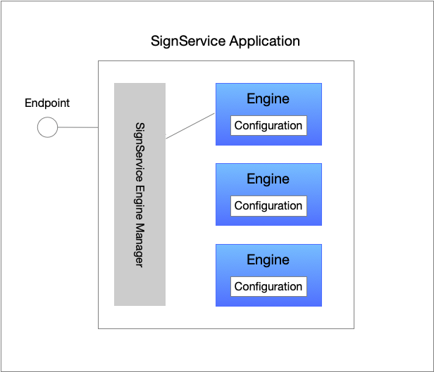
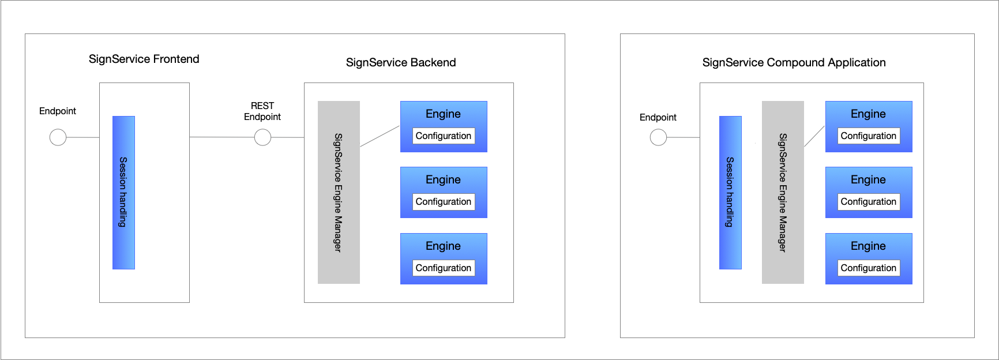
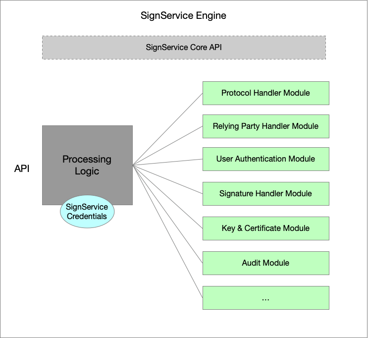
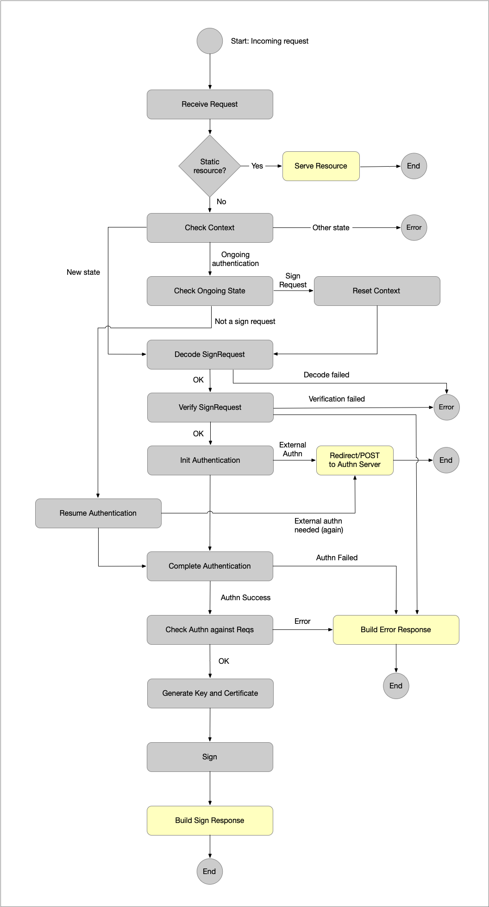

# Signature Service Architectural Overview

## Overall Structure

A signature service application consists of one, or more, ***SignService Engine Instances***. An instantiation of an
engine is intended to support a specific configuration, and normally there is an 1-to-1 relationship between an engine
instance and a specific SignService client (i.e., a relying party).

Each engine is configured with a number of modules for handling tasks like user authentication, protocol
handling, certificate issuance and more. Normally, an engine instance serves one
client, but nothing in the design should prevent several relying parties from sharing the same configuration
(except for keys and such).

The figure below illustrates a SignService Application that has three configured engines (i.e., three configurations),
and how a ***SignService Engine Manager*** is used to communicate with the correct engine, based on which URL
a request was received.

The SignService Application is a simple service that knows very little by itself. It is setup to listen to
one, or more, endpoints, and when a HTTP-request arrives it asks the SignService Engine Manager which engine
that should be handled the incoming request.

The API between the application and the engine is very simple. The engine exposes just one method: `processRequest`
and the return value from this method can be any of:

- POST data to given URL,
- perform a HTTP-Redirect with the given data to a given URL,
- write data to the HTTP response,
- or, in rare cases, display an error message.

It is possible to deploy a SignService application in two ways:

- As a compound application that accepts user requests directly from the user (browser).

- As a frontend/backend deployment where the frontend accepts user requests and communicates with the backend logic using REST-calls.

## SignService Engine

The figure below illustrates a SignService engine and how its processing logic uses a set of different
module instantiations. The engine itself is configured with some basic settings such as credentials, but
most of the configuration comes from each injected module instance. Therefore, the engine can be kept 
reasonable simple, and specific module complexity is abstracted away. 

### Engine Processing Flow

This section describes the processing flow when a request is received and processed. The flow starts
after that the SignService application has found out which engine instance to pass the incoming request to.

* **Receive Request** - When the engine receives a new request it knows nothing about it other that it is
intended for the engine instance. Since an engine may serve "static" resources such as SAML/OIDC metadata,
or status pages, the first thing the engine does is to check whether the incoming request is a request for
a static resource (that can be services by any of the engine modules). If this is the case, we go to the
**Serve Request** action (i.e., the HTTP response is written) and after that the engine is done processing
the request.  Otherwise, the request needs to be processed by the engine, and we proceed to
"Check Context".

* **Check Context** - The engine now asks for the "SignService Context". This context holds everything
the engine needs to know about an operation. This context is stored in the session, and if a new session
object is created, a context object is initialized and its state is set to "New". The state of
the current SignService context can be:

  - "New": This is a new session and the only allowed message to receive in these cases is a SignRequest message, 
  so we proceed to "Decode SignRequest".
  
  - "Ongoing authentication": If the user previously has been directed to an external authentication service
  the response message from the authentication service will pass through the engine. But before we go ahead and 
  assume that this is an authentication response we need to handle the following case:  
  The user starts a signature operation and is directed to the authentication service for
  authentication. The user does not complete this authentication, but instead initiates a
  new signature operation (from within the same web session). This means that we will receive
  a request for a "sign request" in our already started session (having the "ongoing authentication" state).
    
  So, we go to the "Check Ongoing State" flow state.
  
* **Check Ongoing State** - Based on the above we need to check whether this is a "SignRequest" or an 
  "Authentication Response". This is done by inspecting the URL on which the HTTP request was received. Thus,
  we do not inspect the message itself at this point. If this message is received on the URL where we normally
  expect "SignRequest" messages to be delivered, we assume that the previous context is "dead" and we
  reset the context to a "New" state (see "Reset Context" flow state) and go to "Decode SignRequest". 
  But this is an abnormal case that requires the user to abandon a sign operation and to start a new 
  operation within the same session. The normal case is that the current message is an authentication response,
  and if this is the case we go to the "Resume Authentication" flow state.
  
* **Decode SignRequest** - Using the installed "Protocol Handler" module, the engine decodes the incoming
  SignRequest message into a generic representation of a SignRequest. The decode phase only verifies that this
  is a correct SignRequest according to the given protocol. It does not perform any other verification steps.
  These steps are performed in the "Verify SignRequest" flow state (see below). 
  If the decoding of the message fails the SignService engine can not compile an error response message
  to send back to the sign requester. Instead it reports an "unrecoverable" error and terminates the flow.
  The reason that an error response message cannot be sent, is simply that we don't know where to send it.
  
* **Verify SignRequest** - After a SignRequest message has been decoded it needs to be verified. If an error
  occurs during this phase either an "unrecoverable" error is reported, or an error response message is
  created and sent. Which error type that is used depends whether the engine knows enough about the sign
  requester (client) and it is safe to send back a response message (i.e., the signature must have verified
  correctly). If all checks pass, we proceed to "Init Authentication".  
  The verification phase includes controls such as:
  - The sender (sign requester) is a registered client,
  - the signature of the message verifies correctly,
  - this is not a "replay attack", meaning that the same message is sent several times,
  - the message has not been expired,
  - the requirements put in the SignRequest meets the current policy,
  - and much more.
  
* **Init Authentication** - When a SignRequest has been verified and the engine has asserted that it can
  produce a signature, or signatures, based on the request, it is time to authentication the user. Based
  on requirements from the SignRequest and the engine policy a user authentication is initiated. The engine
  has a installed authentication handler module that is invoked. Depending on how that authentication is
  performed this flow state will either redirect the user to an external authentication service (for example
  a SAML AuthnRequest), or it will proceed to "Complete Authentication". In the latter case the SignService
  Context state is set to "Ongoing authentication".
  
* **Resume Authentication** - A flow state that is the initial state if the incoming request is an authentication
  response message. The response message is decoded and control is handed over to "Complete Authentication".
  Note that even if the authentication response is an error response, we proceed to "Complete Authentication" 
  In the figure we have also included a branch to "Redirect/POST" again. This is to support authentication
  schemes that require several external redirects.
  
* **Complete Authentication** - The complete authentication phase is responsible of checking the authentication
  result and if there is an error terminate the flow by sending an error SignResponse message. In the
  successful case, the authentication result is translated into a generic representation of an identity assertion,
  and the flow proceeds to "Check Authn against Reqs".
  
* **Check Authn against Reqs** - Based on a completed authentication this phase verifies that the authentication
  is correct based on the requirements from the SignRequest message. Was the correct user authenticated? Did 
  we received all required user attributes? Was the authentication performed under the required context? And so on.
  If an error is detected, we send back and error response and terminate the flow. Otherwise we proceed to 
  "Generate Key and Certificate".
  
* **Generate Key and Certificate** - OK, now we have an authenticated user and the SignRequest has been 
  validated. The next step is to generate a private key and a certificate containing information given in
  the SignRequest and policy. This step usually involves communicating with a CA (certificate authority)
  by this is abstracted away from the engine and the implementation is provided by the installed "Key and Certificate"
  handler module. 
  The figure does not include a branch to an error state. Of course, errors can always occur, but for simplicity
  this is not included.
  
* **Sign** - Given the private key and the generated certificate the signature task(s) from the SignRequest
  is now signed.
  
* **Build Sign Response** - When the engine has signed the requested data a SignResponse message is compiled.
  For this the "Protocol Handler" module is used. This also includes signing the message (for integrity).
  This completes the engine flow.
  
-----

Copyright &copy; 2022-2024, [Myndigheten för digital förvaltning - Swedish Agency for Digital Government (DIGG)](http://www.digg.se). Licensed under version 2.0 of the [Apache License](http://www.apache.org/licenses/LICENSE-2.0).
  

  
  

