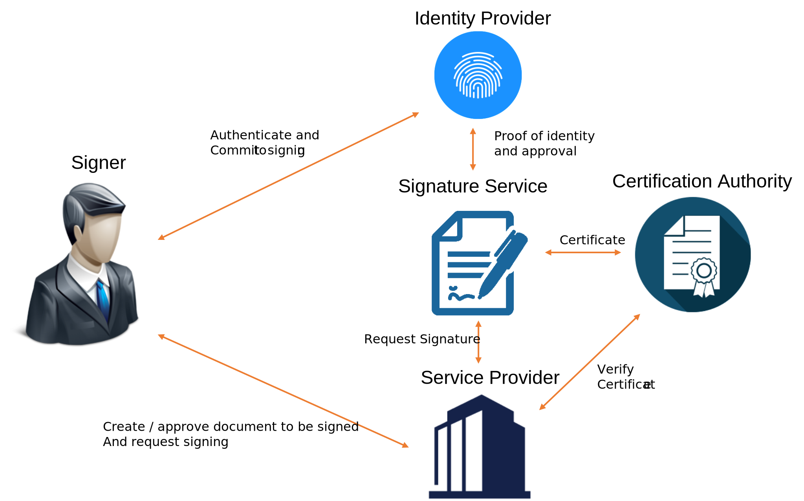
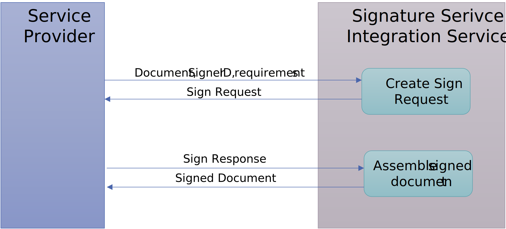

# What is a Signature Service?

## Overview

A signature service is the central service component in a remote signing setup (also known as Federated Signing) as illustrated
in this figure. This setup is characterized by a signature process that involves a number of independent services and actors with
distinct roles:

| Role                    | Description                                                                                                                          |
|:------------------------|:-------------------------------------------------------------------------------------------------------------------------------------|
| Signer                  | A natural person that is signing a document.                                                                                         |
| Service Provider        | The service visited by the signer where the signer reviews agrees to sign.                                                           |
| Signature Service       | Central service component that manages the signature process and creates the signature.                                              |
| Identity Provider       | The signer's eID service where the signer uses his/her eID to authenticate and commit to sign.                                       |
| Certification Authority | Creates the signer certificate that is attached to the signature based on the authentication of the signer in the signature process. |

## Specific characteristics of the Federated Signing model

Traditional remote signature services store a static persistent signing key for each natural person signer. Each such key is
associated with a static and persistent certificate attached to all signatures created by a particular signer. This 
setup requires that the user has a persistent relationship with that signing service and means to ensure
that each signing key is never ever used by more than one signer.

The federated signing model avoids this significant management overhead by always generating a new key and a new
signing certificate for each instance of signing and by immediately and permanently destroying all knowledge
about the signing key after completed signing. In this setup there is no need to have any user-accounts for storing
private signing keys and to prevent multiple signer's from using the same key. This is replaced by a process
where the signer is authenticated at each instance of signing, typically using an open federated authentication infrastructure 
(hence the popular name "Federated Signing").

## Signing flow

A significant advantage with this model where the signer has no persistent relationship with the
signature service, is that the signature service can be made invisible to the signer and integrated into the
service provider. This creates a natural service context where the service provider is responsible for the complete 
user experience of the signing process and the identity provider is responsible for the authentication and commitment
process. This provides a natural and logical signature process as illustrated by the following example:

**Signing tax declaration user experience:**

1) The user visits the Tax authority website to complete a tax declaration. When all information is entered and reviewed, the user choose to sign and submit the declaration.
2) The user is prompted to use his/her eID where the user examines a "sign message" related to this tax declaration and accepts to sign.
3) The user is returned to the tax declaration service and gets a receipt and confirmation that the tax declaration is signed and submitted.

From the signer's perspective the signature service simply a part of the service provider.

What actually happens is somewhat more complex, as illustrated by the image above:

1) When the user agrees to sign, the Service Provider creates transfers the user to the Signature service with a Sign Request that holds the information necessary for the Signing Service to complete the signing process.
2) The Signature Service examines the request and transfers the user to the appropriate Identity Provider for authentication and acceptance to sign.
3) The Identity Provider presents signature acceptance data authenticates the signer.
4) The Identity Provider transfers the user back to the Signature Service with proof of identity and acceptance to sign.
5) The Signature Service generates a signing key and collaborates with the Certification Authority to create a signing certificate
6) The Signature Service completes the signature process and transfers the signer back to the Service Provider with signature data in a Sign Response.
7) The Service Provider assembles the signed document based on the data received from the Signature Service.

## Signature Service Integration

The protocol that specifies the Sign Request and Sign Response messages in this model is defined in a number of 
specifications published by Sweden Connect eID framework specifications:

1) [DSS Extension for Federated Central Signing Services](https://docs.swedenconnect.se/technical-framework/latest/09_-_DSS_Extension_for_Federated_Signing_Services.html)
2) [Implementation Profile for using OASIS DSS in Central Signing Services](https://docs.swedenconnect.se/technical-framework/latest/07_-_Implementation_Profile_for_using_DSS_in_Central_Signing_Services.html)
3) [Certificate Profile for Certificates Issued by Central Signing Services](https://docs.swedenconnect.se/technical-framework/latest/08_-_Certificate_Profile_for_Central_Signing_Services.html)
4) [Signature Activation Protocol for Federated Signing](https://docs.swedenconnect.se/technical-framework/latest/13_-_Signature_Activation_Protocol.html)

A key feature of the signature flow is that the actual document that is signed is never passed to the Signature Service.
The 

-----

Copyright &copy; 2022, [Myndigheten för digital förvaltning - Swedish Agency for Digital Government (DIGG)](http://www.digg.se). Licensed under version 2.0 of the [Apache License](http://www.apache.org/licenses/LICENSE-2.0).

