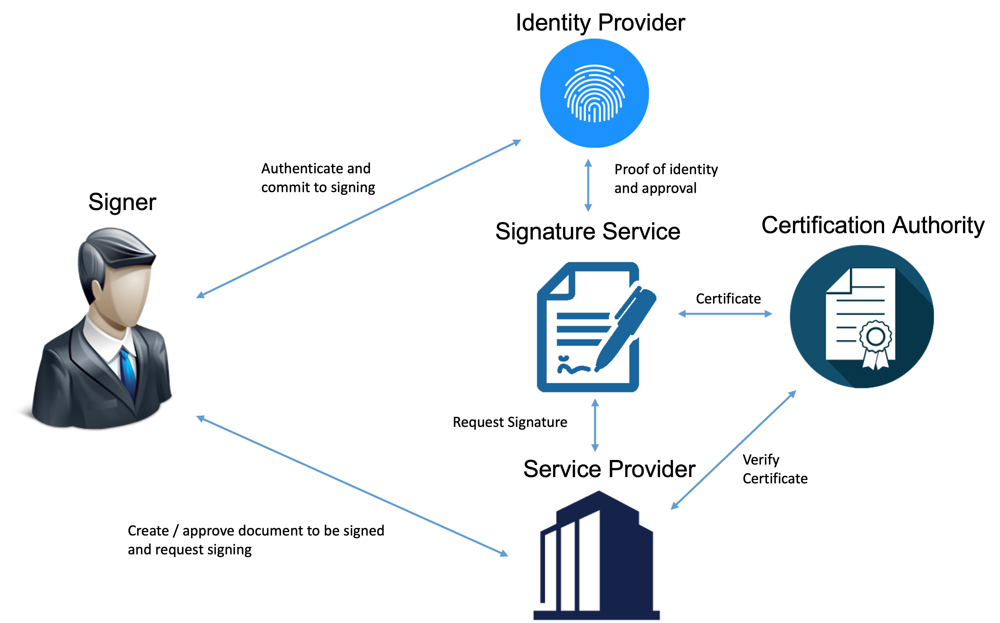
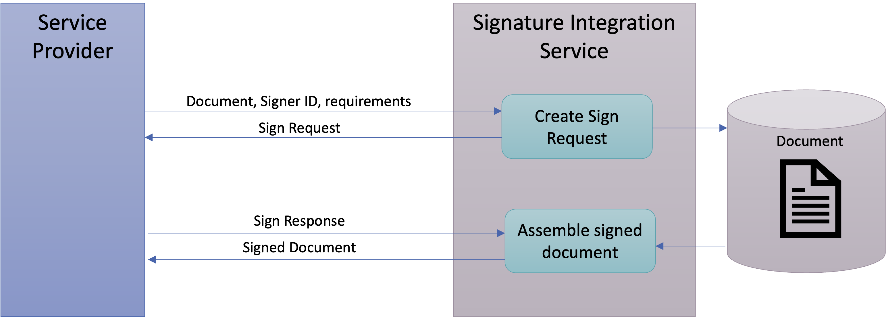

# What is a Signature Service?

## Overview

A signature service is the central service component in a remote signing setup (also known as Federated Signing) as illustrated
in this figure. This setup is characterized by a signature process that involves a number of independent services and actors with
distinct roles:

| Role                    | Description                                                                                                                                           |
|:------------------------|:------------------------------------------------------------------------------------------------------------------------------------------------------|
| Signer                  | A person that is signing a document.                                                                                                                  |
| Service Provider        | The service visited by the signer where the signer reviews data to be signed and agrees to sign. This is also referred to as a "Signature Requester". |
| Signature Service       | Central component that manages the signature process and creates the signature.                                                                       |
| Identity Provider       | The eID service where the signer uses his/her eID to authenticate and agrees to sign.                                                                 |
| Certification Authority | Creates the signer's certificate that is attached to the signature based on the authentication of the signer in the signature process.                |

## Specific characteristics of the Federated Signing model

Traditional remote signature services store a static persistent signing key for each natural person signer. Each such key is
associated with a static and persistent certificate attached to all signatures created by a particular signer. This 
setup requires that the signing service has a persistent relationship with each signer and has means to ensure
that each signing key is never ever used by more than one signer.

The federated signing model (implemented by Sweden Connect Signing Service) avoids this management overhead by always generating a new key and a new
signing certificate for each instance of signing and by immediately and permanently destroying all knowledge
about the signing key after completed signing. In this setup there is no need to have persistent user-accounts for storing
private signing keys and to prevent multiple signers from using the same key. This is replaced by a process
where the signer is authenticated at each instance of signing, typically using an open federated authentication infrastructure 
(hence the popular name "Federated Signing").

This type of Signing Service is therefore optimised for a setup where the agreement with the signer to use the Signing Service for signing, and where the
responsibility for the signing process, is managed by the Service Provider as a condition for using the service.

## Signing flow

A significant advantage with this model where the signer has no persistent relationship with the
Signature Service, is that the Signature Service can be made invisible to the signer and integrated into the
service provider. This creates a natural service context where the Service Provider is responsible for the complete 
user experience of the signing process and the Identity Provider is responsible for the authentication and commitment
process. This provides a natural and logical signature process as illustrated by the following example:

**Signing tax declaration user experience:**

1. The user visits the Tax authority website to complete a tax declaration. When all information is entered and reviewed, the user choose to sign and submit the declaration.
2. The user is prompted to use his/her eID where the user examines a "sign message" related to this tax declaration and accepts to sign.
3. The user is returned to the tax declaration service and gets a receipt and confirmation that the tax declaration is signed and submitted.

From the signer's perspective the Signature Service is simply a part of the Service Provider.

What actually happens is somewhat more complex, as illustrated by the image above:

1. When the user agrees to sign, the Service Provider creates transfers the user to the Signature Service with a Sign Request that holds the information necessary for the Signing Service to complete the signing process.
2. The Signature Service examines the request and transfers the user to the appropriate Identity Provider for authentication and acceptance to sign.
3. The Identity Provider presents signature acceptance data authenticates the signer.
4. The Identity Provider transfers the user back to the Signature Service with proof of identity and acceptance to sign.
5. The Signature Service generates a signing key and collaborates with the Certification Authority to create a signing certificate
6. The Signature Service completes the signature process and transfers the signer back to the Service Provider with signature data in a Sign Response.
7. The Service Provider assembles the signed document based on the data received from the Signature Service.

## Signature Service Integration

The protocol that specifies the Sign Request and Sign Response messages in this model is defined in a number of 
specifications published by Sweden Connect eID framework specifications:

1. [DSS Extension for Federated Central Signing Services](https://docs.swedenconnect.se/technical-framework/latest/09_-_DSS_Extension_for_Federated_Signing_Services.html)
2. [Implementation Profile for using OASIS DSS in Central Signing Services](https://docs.swedenconnect.se/technical-framework/latest/07_-_Implementation_Profile_for_using_DSS_in_Central_Signing_Services.html)
3. [Certificate Profile for Certificates Issued by Central Signing Services](https://docs.swedenconnect.se/technical-framework/latest/08_-_Certificate_Profile_for_Central_Signing_Services.html)
4. [Signature Activation Protocol for Federated Signing](https://docs.swedenconnect.se/technical-framework/latest/13_-_Signature_Activation_Protocol.html)

To avoid the complexity of implementing these specifications, Service Providers normally use a separate integration service
as a backend service to create Sign Request and to parse Sign Response documents in order to complete the signing process.

One important feature of this setup is that the actual document to be signed is not part of the Sign Request
or the Sign Response messages as the document itself is not necessary for the actual signature process. This has
a number of important advantages, such as allowing signing of sensitive information while remaining a high level of
integrity and confidentiality. But this also requires the actual signed document to be stored when creating the sign request
and retrieved from storage when parsing the Sign Response to complete the signing process. Different integration
solutions exists that provides integration service both as an API for direct integration
and as a REST API provided by a separate service.

One such integration service that can provide integration both as Java API and through REST API
is available as open source is available [here](https://github.com/idsec-solutions/signservice-integration).

## Leves of security and variations of authentication methods

The present Signature Service is adapted to serve a wide range of security levels from Qualified Electronic
Signatures according to the EU eIDAS regulation, to lower levels of security based on simpler forms of authentication.

Several components of the specifications and features of the implementation are configurable to meet the requirements
and the context within which the Signature Service is used.

Such aspects are:

 - Whether the Identity Provider must show a sign message or not and get explicit approval for signing
 - What level of assurance (LoA) the Identity Provider must use when authenticating the signer
 - What certificate policy that is used to issue the signature certificate.
 - The level of protection of the signer's signing key
 - The algorithms and key sizes used to generate signatures

The overview above is written to illustrate features which are relevant only in a high level security setup, such as
functions to display a sign message and strict enforcement of the signer's commitment to sign. It is
important to note that many of these processes are supported by not required. For example, it is perfectly possible to use a setup
where the Identity Provider role is reduced to just authenticate the signer without showing any sign message.

The Signature Service implemented here is intentionally modular in a way that allows multiple handlers for
various forms of integrations with authentication frameworks or external Certification Authority services.

This is further explained in the [architecture section](https://github.com/swedenconnect/signservice/blob/main/docs/architechture.md).

-----

Copyright &copy; 2022, [Myndigheten för digital förvaltning - Swedish Agency for Digital Government (DIGG)](http://www.digg.se). Licensed under version 2.0 of the [Apache License](http://www.apache.org/licenses/LICENSE-2.0).

