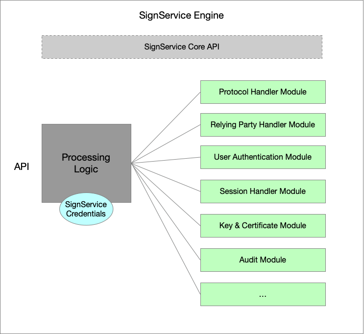

# Signature Service Design Documentation

## Overall Structure

A signature service application consists of one, or more, ***SignService Instances***. Such an instance
is an instantiation of a ***SignService Engine*** that is configured to support a specific configuration.
Each engine is configured with a number of modules for handling things like user authentication, protocol
handling, session management, certificate issuance and more. Normally, a SignService Instance serves one
relying party, but nothing in the design should prevent several relying parties from sharing the same configuration
(except for keys and such).

The figure below illustrates a SignService Application that has three configured engines (i.e., three configurations),
and how a ***SignService Engine Manager*** is used to communicate with the correct engine, based on which URL
a request was received.

The SignService Application is a simple service that knows very little by itself. It is setup to listen to
one, or more, endpoints, and when a HTTP-request arrives it asks the SignService Engine Manager which engine
that should be handled the incoming request.

The API between the application and the engine is very simple. The engine exposes just one method: `processRequest`
and the return value from this method can be any of:

- POST data to given URL,
- Perform a HTTP-Redirect with the given data to a given URL,
- or, in rare cases, display an error message.

## SignService Instance

> TODO

## Modules

## Flows

> TODO